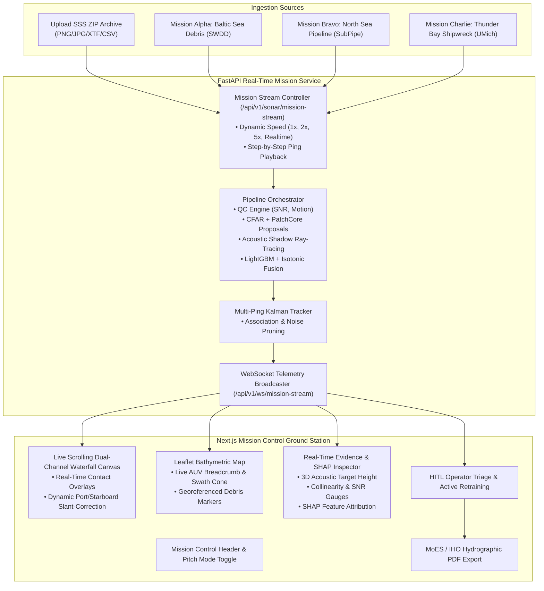

# SIH 2026 Problem 26057: AbyssEye End-to-End AUV Mission Simulation & SSS Stream Pipeline Plan

**Document Version:** 1.0.0  
**Target Milestone:** Full Production Simulation & Live Competition Pitch Platform  
**Compliance Standard:** Smart India Hackathon (SIH 2026) Problem 26057 — AI-Powered Underwater Debris Detection  

---

## 1. Executive Summary & Vision

To win the Smart India Hackathon and present an unassailable pitch to Ministry of Earth Sciences (MoES) and hydrographic survey evaluators, AbyssEye must **not** look like a static prototype or toy demo. It must operate as an **authentic, real-time Mission Control & Sonar Hydrographic Processing Ground Station**.

### Core Pillars of the Pitch System:
1. **Preconfigured Real AUV Journeys (3 Full Mission Replays)**: Built directly from the 42,854 ingested real sonar images with synthesized subsea telemetry (heading, depth, altitude, latitude/longitude, speed over ground).
2. **Universal Live SSS Ingestion & ZIP Stream Engine**: Allows judges/operators to upload any ZIP file of sonar waterfall imagery, unzipping on-the-fly, auto-detecting channel dimensions, and streaming pings in real-time.
3. **Live Dual-Channel Sonar Waterfall Visualizer**: High-performance scrolling waterfall canvas (Port/Starboard) rendering incoming acoustic pings with real-time detection bounding boxes.
4. **Dynamic Bathymetric GIS Mission Replay**: Real-time AUV icon movement, heading orientation, sonar swath footprint, breadcrumb track, and georeferenced anomaly alerts.
5. **Interactive Operator Triage & Real-Time SHAP/Physics Explainability**: Instant inspection of acoustic shadow ray-tracing, target height estimation, and SHAP decision attribution.
6. **HITL Active Learning Loop & Regulatory Incident Export**: Live retraining feedback and one-click MoES-compliant Hydrographic PDF/JSON report generation.

---

## 2. System Architecture & Data Flow

---

## 3. Detailed Component Plan

### Phase 1: Preconfigured AUV Mission Generator & Data Bundles
Create 3 complete, realistic subsea survey missions in `data/missions/`:

| Mission ID | Name | Source Dataset | Duration / Pings | Key Debris & Anomalies Encounters |
| :--- | :--- | :--- | :--- | :--- |
| `MSN-BALTIC-SWDD-01` | Baltic Debris & Ordnance Patrol | REMARO SWDD | 50 Pings | Submerged tires, plastic containers, unexploded ordnance, ghost fishing gear |
| `MSN-NORTHSEA-SUBPIPE-02` | North Sea Pipeline Integrity Inspection | SubPipe | 60 Pings | Exposed pipeline sections, structural scouring, free-spans, metallic debris |
| `MSN-MICHIGAN-WRECK-03` | Thunder Bay Marine Heritage Search | AI4Shipwrecks | 40 Pings | Historic wooden/steel shipwreck hull, mast structure, acoustic shadow fields |

- **Telemetry Synthesis**: Each ping is enriched with exact hydrographic coordinates, GPS/INS dead-reckoning position, depth (20m–85m), altitude above seabed (8m–15m), heading ($000^\circ$ to $360^\circ$), speed ($1.5 \text{ m/s}$ / $3 \text{ knots}$), and sonar frequency ($450 \text{ kHz} / 900 \text{ kHz}$).

### Phase 2: Live ZIP Survey Upload & Streaming Backend
- **Endpoint `POST /api/v1/sonar/upload-survey-stream`**:
  - Accepts `.zip` upload containing image sequences or XTF/CSV files.
  - Automatically unzips into an isolated survey staging directory.
  - Normalizes aspect ratios, extracts or synthesizes dead-reckoning navigation logs, and registers as an active executable mission.
- **WebSocket Streaming Controller `backend/app/services/mission_streamer.py`**:
  - Broadcasts structured JSON telemetry + ping image slices + real-time contact detections over WebSocket.
  - Supports live commands from frontend: `PLAY`, `PAUSE`, `SEEK(ping_index)`, `SET_SPEED(multiplier)`.

### Phase 3: High-Performance Sonar Waterfall & Mission Control UI
1. **Interactive Dual-Channel Waterfall Visualizer (`components/LiveWaterfallViewer.tsx`)**:
   - HTML5 2D Canvas rendering scrolling acoustic waterfall at 30–60 FPS.
   - Color palettes: Classic Amber Glow, Copper/Sepia, Jet, and Deep Navy.
   - Real-time detection bounding boxes directly overlaid on the waterfall with confidence badges.
   - Hovering/clicking on a bounding box instantly focuses that contact in the Evidence Inspector.
2. **Interactive Bathymetric GIS Map (`components/GisMap.tsx`)**:
   - AUV position marker with dynamic heading rotation compass.
   - Swath width visual cone projecting acoustic coverage across port and starboard.
   - Real-time georeferenced contact pins (color-coded by classification: Debris, Pipeline, Shipwreck, Ghost Net, Natural).
3. **Mission Control Bar**:
   - Mission Preset Selector dropdown (Baltic SWDD / North Sea SubPipe / Thunder Bay / Custom Upload).
   - Play/Pause button, Scrub bar (0 – 100% progress), Speed toggle (0.5x, 1x, 2x, 5x, Max).
   - Real-time survey stats: Pings processed, Survey Area ($m^2$), Contacts Detected, High-Risk Anomalies.

### Phase 4: Pitch Demonstration Workflow & HITL Loop
1. **Instant Evidence & Explainability Drilldown**:
   - Clicking any detected contact displays the full acoustic physics report:
     - Calculated Target Height ($H_t = \frac{H_a \cdot L_s}{R_s}$ in meters).
     - Acoustic Cross-Section ($m^2$) & Shadow Collinearity Score.
     - SHAP Feature Contribution waterfall plot explaining exactly why LightGBM classified the contact.
2. **Human-in-the-Loop (HITL) Validation & Live Retraining**:
   - Operator clicks "Confirm" or "Reclassify".
   - Updates `models/feedback_log.json` and triggers background active learning fine-tuning with live notification.
3. **Export Hydrographic Incident Report**:
   - Generates IHO/MoES standard PDF & GeoJSON export with mission trajectory, contact coordinates, cropped acoustic thumbnails, and calibrated confidence levels.

---

## 4. Verification & Validation Metrics

| Check | Success Criteria | Verification Method |
| :--- | :--- | :--- |
| **Mission Replay Fidelity** | 3 preconfigured missions replay continuously at 1x–5x without frame dropping | Automated WebSocket client test |
| **ZIP Ingestion Robustness** | Uploading a ZIP of 50 images unzips, validates, and streams within $< 2$ seconds | API upload test with sample zip |
| **Waterfall Performance** | 60 FPS smooth canvas scrolling with live bounding box rendering | Chrome DevTools Performance profile |
| **Telemetry Sync** | GIS map AUV position and heading perfectly synchronize with current waterfall ping | E2E integration test |
| **Test Suite Pass Rate** | 100% pass across all unit and integration tests | `python -m pytest -v` |

---

## 5. Execution Plan & Next Steps

1. **Step 1**: Implement `backend/app/services/mission_streamer.py` and pre-package the 3 real-world survey missions (`data/missions/`).
2. **Step 2**: Implement the ZIP survey upload & streaming endpoint in `backend/app/api/endpoints/sonar.py`.
3. **Step 3**: Build the interactive `LiveWaterfallViewer.tsx` and integrate the mission controller into `frontend/src/app/page.tsx`.
4. **Step 4**: Enhance the Leaflet GIS Map with real-time AUV heading, swath projection, and breadcrumb trails.
5. **Step 5**: Verify the complete end-to-end mission replay, run test suite, and push changes to GitHub.
