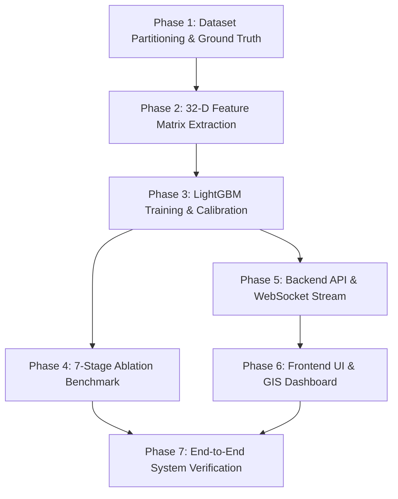

# ABYSSEYE: End-to-End Model Training & Pipeline Integration Plan

**Project:** ABYSSEYE — Automated Underwater Marine Debris & Anomaly Detection System (SIH Problem 26057)  
**Document Type:** Project Execution Plan  
**Target File:** `training-pipeline-plan.md`  
**Status:** Ready for Execution  

---

## 🎯 Executive Objective

Train, calibrate, benchmark, and deploy the complete **ABYSSEYE multi-modal evidence fusion pipeline** using the ingested real-world datasets (**SubPipeMini/MiniSSS**, **REMARO-SWDD**, **UMich AI4Shipwrecks**) and the **Physics-Grounded Synthetic Sonar Generator**, establishing an end-to-end automated system from raw sonar ping ingestion to real-time operator triage and GIS bathymetric mapping.

```
+-----------------------------------------------------------------------------------------+
|                               RAW SONAR DATA INGESTION                                  |
|   42,854 Real Sonar Images (SubPipe, SWDD, AI4Shipwrecks) + Physics Synthetic Pings   |
+-----------------------------------------------------------------------------------------+
                                             │
                                             ▼
+─────────────────────────────────────────────────────────────────────────────────────────+
|                           STAGE 1: QUALITY CONTROL & FILTERING                          |
|         Automated SNR, Saturation, Contrast & Geometric Slant-Range Correction          |
+─────────────────────────────────────────────────────────────────────────────────────────+
                                             │
                                             ▼
+─────────────────────────────────────────────────────────────────────────────────────────+
|                      STAGE 2: HYBRID CANDIDATE CONTACT DISCOVERY                        |
|    ┌─────────────────────────────────┐       ┌─────────────────────────────────┐        |
|    │   PatchCore Feature Memory Bank │       │   CA-CFAR Adaptive Threshold    │        |
|    │   (Unsupervised Open-Set Anomaly)│      │   (Acoustic Highlight Peaks)    │        |
|    └─────────────────────────────────┘       └─────────────────────────────────┘        |
|                                      ▼                                                  |
|                        Candidate Proposal Clustering & Fusion                           |
+─────────────────────────────────────────────────────────────────────────────────────────+
                                             │
                                             ▼
+─────────────────────────────────────────────────────────────────────────────────────────+
|               STAGE 3: PARALLEL PHYSICS, CONTEXT & TRACKING FEATURE ENGINES             |
|   1. Acoustic Physics Engine  : Highlight-Shadow Collinearity & Geometric Target Height |
|   2. Filament Netting Engine  : Gabor Wavelet Striations & Mesh Periodicity             |
|   3. Multi-Ping Kalman Tracker: Cross-Ping Hungarian Matching & Track Persistence       |
|   4. Seabed Context Engine    : GLCM Contrast / Energy / Entropy Differential Rings     |
+─────────────────────────────────────────────────────────────────────────────────────────+
                                             │
                                             ▼
+─────────────────────────────────────────────────────────────────────────────────────────+
|                   STAGE 4: 32-D EVIDENCE VECTOR COMPILATION & FUSION                    |
|             LightGBM GBDT Classifier + Isotonic Probability Calibration                 |
|             P(Anthropogenic)  |  P(Natural Seabed)  |  P(Uncertain / Review)            |
+─────────────────────────────────────────────────────────────────────────────────────────+
                                             │
                                             ▼
+─────────────────────────────────────────────────────────────────────────────────────────+
|                     STAGE 5: EXPLAINABILITY & OPERATOR TRIAGE UI                        |
|       SHAP Feature Contributions + Acoustic Profile Plot + Leaflet Bathymetric GIS     |
+─────────────────────────────────────────────────────────────────────────────────────────+
```

---

## 📊 Target Performance Metrics & Acceptance Criteria (PRD v3.0)

| Metric | Target Baseline | Definition of Done |
|---|---|---|
| **Overall $F_1$-Score** | $\ge 0.88$ | Weighted harmonic mean across debris classes |
| **Open-Set Anomaly Recall (Ghost Nets)** | $\ge 0.85$ | High sensitivity on novel / unlabelled fibrous debris |
| **ROC-AUC (Anthropogenic vs Natural)** | $\ge 0.94$ | Area under receiver operating characteristic curve |
| **Brier Calibration Score** | $\le 0.08$ | Probabilities strictly calibrated to empirical frequencies |
| **False Positive Suppression** | $\ge 70\%$ | Rejection of natural reefs, sand ripples, and noise |
| **Per-Frame Inference Latency** | $\le 120\text{ ms}$ | Full 8-stage pipeline per $768 \times 384$ ping on standard CPU/GPU |

---

## 🏗️ Detailed Phase-by-Phase Task Breakdown

### Phase 1: Dataset Partitioning, Metadata Harmonization & Ground Truth Compilation
* **Responsible Agent:** `backend-specialist` / `database-architect`
* **Inputs:**
  * `data/raw/subpipe` (35,174 images + telemetry CSVs)
  * `data/raw/swdd` (7,108 images)
  * `data/raw/umich_sonar/AI4Shipwrecks` (572 images + segmentation masks)
  * `ml/ingestion/synthetic_generator.py` (Procedural ray-tracing engine)
* **Tasks:**
  1. **Survey-Level Train/Val/Test Split Protocol**:
     - Split data strictly by **survey/mission ID** (70% train, 15% validation, 15% benchmark test) to eliminate temporal/spatial data leakage.
  2. **Harmonized Annotation Compiler**:
     - Map diverse source annotations (SubPipe bounding boxes, SWDD debris tags, AI4Shipwrecks binary masks) into unified `ContactAnnotation` schemas (`[x, y, w, h, class_label, is_anthropogenic]`).
  3. **Background Normal Seabed Extraction**:
     - Extract 1,500 pure natural seabed patches across mud, sand ripples, and rocky reefs for PatchCore memory bank training.
* **Outputs:**
  * `data/processed/splits/train_manifest.json`
  * `data/processed/splits/val_manifest.json`
  * `data/processed/splits/test_manifest.json`
  * `data/processed/normal_seabed_patches/`

---

### Phase 2: Feature Extraction Pipeline & Dataset 32-D Matrix Generation
* **Responsible Agent:** `backend-specialist` / `performance-optimizer`
* **Inputs:** Manifest files from Phase 1, `ml/ingestion/dataset_loader.py`
* **Tasks:**
  1. **PatchCore Memory Bank Fitting**:
     - Fit `PatchCoreAnomalyDetector` on the 1,500 natural seabed background patches.
     - Execute greedy k-center coreset subsampling ($N_{\text{coreset}} = 500$) and persist memory bank to disk (`models/patchcore_memory_bank.npy`).
  2. **Batch 32-D Evidence Vector Extraction**:
     - Implement batch parallel feature extractor using `ProcessPoolExecutor` to process training and validation frames.
     - For each frame: run QC $\to$ Filter $\to$ Proposals (CFAR + PatchCore) $\to$ Physics Engine $\to$ Filament Analyzer $\to$ Context Engine $\to$ Kalman Tracker.
     - Assemble full 32-dimensional feature vectors with binary labels ($y \in \{0, 1\}$) and multi-class target hints.
  3. **Feature Matrix Artifacts**:
     - Save compressed numpy feature matrices for rapid model iteration.
* **Outputs:**
  * `models/patchcore_memory_bank.npy`
  * `data/processed/features/X_train.npy`, `data/processed/features/y_train.npy`
  * `data/processed/features/X_val.npy`, `data/processed/features/y_val.npy`
  * `data/processed/features/X_test.npy`, `data/processed/features/y_test.npy`

---

### Phase 3: LightGBM Model Training, Isotonic Calibration & SHAP Explainability
* **Responsible Agent:** `backend-specialist`
* **Inputs:** `X_train.npy`, `y_train.npy`, `X_val.npy`, `y_val.npy`
* **Tasks:**
  1. **Hyperparameter Optimization & Cross-Validation**:
     - Run 5-fold Stratified K-Fold cross-validation on `X_train`.
     - Optimize LightGBM parameters (`num_leaves`, `max_depth`, `learning_rate`, `feature_fraction`, `min_child_samples`, `colsample_bytree`).
  2. **Isotonic Probability Calibration**:
     - Fit out-of-fold `IsotonicRegression` calibrator on cross-validated logit predictions to map raw boosting scores to true empirical probabilities.
     - Define three-tier triage thresholding:
       * **High Confidence ($P_{\text{anth}} \ge 0.75$)** $\to$ Direct Alert
       * **Review / Triage ($0.35 \le P_{\text{anth}} < 0.75$)** $\to$ Human Operator Queue
       * **Natural Seabed ($P_{\text{anth}} < 0.35$)** $\to$ Suppressed False Alarm
  3. **SHAP TreeExplainer Compilation**:
     - Initialize and validate fast TreeExplainer for generating real-time top-5 feature attributions for every detected contact.
  4. **Model Export**:
     - Package and persist trained booster and calibrator to `models/lightgbm_fusion_latest.joblib`.
* **Outputs:**
  * `models/lightgbm_fusion_latest.joblib`
  * `data/evaluation/calibration_curve.png`
  * `data/evaluation/training_metrics_report.json`

---

### Phase 4: 7-Stage Progressive Ablation Study & Benchmark Suite
* **Responsible Agent:** `qa-automation-engineer` / `backend-specialist`
* **Inputs:** `models/lightgbm_fusion_latest.joblib`, `X_test.npy`, `y_test.npy`
* **Tasks:**
  1. **Execute 7-Stage Progressive Ablation Matrix (Hypotheses H1–H6)**:
     - **Exp A (Baseline)**: Classical CFAR proposals + Intensity features only.
     - **Exp B (+ Physics)**: Add Highlight-Shadow Collinearity & Geometric Height.
     - **Exp C (+ Tracking)**: Add Multi-Ping Kalman Persistence & Track Residuals.
     - **Exp D (+ Context)**: Add GLCM Seabed Context Differential Rings.
     - **Exp E (+ PatchCore)**: Add Unsupervised Open-Set PatchCore Anomaly Scoring.
     - **Exp F (+ Active Learning)**: Include Retrained Continuous Active Learning Set.
     - **Exp G (Full ABYSSEYE)**: All 32 features with Isotonic Calibration.
  2. **Generate Benchmark Analysis Report**:
     - Calculate $F_1$, ROC-AUC, Brier score, and False Alarm Reduction Rate for each ablation step.
     - Export comprehensive ablation table and markdown summary.
* **Outputs:**
  * `experiments/results/ablation_benchmark_results.json`
  * `docs/ABLATION_BENCHMARK_REPORT.md`

---

### Phase 5: Backend API, Real-Time WebSocket Telemetry & Active Learning Service
* **Responsible Agent:** `backend-specialist`
* **Inputs:** `models/lightgbm_fusion_latest.joblib`, `data/contacts/`
* **Tasks:**
  1. **REST Endpoints Validation & Enhancement**:
     - `POST /api/v1/sonar/upload`: Ingest GeoTIFF/waterfall and execute full pipeline.
     - `GET /api/v1/contacts`: Query contacts with filtering (by triage state, channel, confidence).
     - `POST /api/v1/contacts/{id}/review`: Operator confirmation / reclassification.
     - `GET /api/v1/gis/layers`: GeoJSON export of survey tracklines and georeferenced contact points.
     - `GET /api/v1/reports/mission`: PDF/JSON mission export.
  2. **WebSocket Real-Time Telemetry Stream**:
     - `WS /api/v1/ws/survey-stream`: Stream live ping waterfalls, candidate detections, and tracking updates at 10 Hz.
  3. **Active Learning Service Integration**:
     - Implement query strategies (Uncertainty Sampling, Anomaly Novelty Sampling, Diversity K-Means).
     - Trigger automated incremental model retraining upon collecting $N \ge 50$ operator reviews.
* **Outputs:**
  * `backend/app/api/endpoints/` (fully tested endpoints)
  * `ml/active_learning/retrain_service.py` (live active learning loop)

---

### Phase 6: Frontend Operator Triage Dashboard & GIS Bathymetric Interface
* **Responsible Agent:** `frontend-specialist`
* **Inputs:** Next.js application in `frontend/`, API specifications
* **Tasks:**
  1. **Real-Time Triage Queue**:
     - Priority-ordered queue displaying new contacts with triage badges (High Confidence, Review, Natural).
  2. **Interactive Evidence Card**:
     - Dual-channel waterfall zoom snippet.
     - Along-track acoustic profile plot (ambient $\to$ highlight $\to$ shadow $\to$ recovery).
     - Top-5 SHAP feature contribution bar chart explaining *why* the decision was made.
     - Physical target parameters (Estimated height, collinearity score, track persistence).
  3. **Leaflet Bathymetric Mission Map**:
     - Real-time survey ship trackline with towfish layback position.
     - Georeferenced contact markers colored by triage status with popup evidence summaries.
  4. **Operator Action Controls**:
     - One-click verification (`Verify Anthropogenic`, `Mark False Alarm`, `Add to Active Learning`).
* **Outputs:**
  * `frontend/src/components/EvidenceCard.tsx`
  * `frontend/src/components/GisMap.tsx`
  * `frontend/src/components/TriageQueue.tsx`
  * `frontend/src/components/AcousticProfilePlot.tsx`
  * `frontend/src/components/ShapContributionPlot.tsx`

---

### Phase 7: System Verification, E2E Testing & Demonstration Runner
* **Responsible Agent:** `qa-automation-engineer`
* **Inputs:** Complete integrated pipeline
* **Tasks:**
  1. **Automated Unit & Integration Test Suite**:
     - Execute all tests across `tests/` (`test_physics.py`, `test_discovery.py`, `test_tracking.py`, `test_context.py`, `test_fusion.py`, `test_api.py`, `test_e2e_pipeline.py`).
  2. **End-to-End Mission Simulation Runner**:
     - Run `scripts/demo_runner.py` to stream a complete simulated mission and verify zero pipeline dropouts.
  3. **Performance Profiling & Latency Benchmarks**:
     - Profile per-stage execution times and confirm total latency $< 120\text{ ms}$ per ping.
* **Outputs:**
  * Complete passing test suite (`pytest -v`)
  * `docs/E2E_VERIFICATION_REPORT.md`

---

## 🗓️ Execution Sequence & Dependencies



---

## 🛠️ Verification Checklist

- [ ] All 42,854 real images + synthetic pings partitioned with zero survey-level leakage.
- [ ] PatchCore memory bank fitted and saved to `models/patchcore_memory_bank.npy`.
- [ ] 32-D feature vector dataset generated and saved.
- [ ] LightGBM fusion model trained, isotonic calibrated, and saved to `models/lightgbm_fusion_latest.joblib`.
- [ ] Brier score $\le 0.08$ and $F_1 \ge 0.88$ verified.
- [ ] 7-stage ablation matrix successfully benchmarked.
- [ ] FastAPI backend running with WebSocket telemetry stream.
- [ ] Next.js dashboard rendering Evidence Cards, SHAP plots, and Leaflet GIS map.
- [ ] Full E2E demo runner executing without errors.
